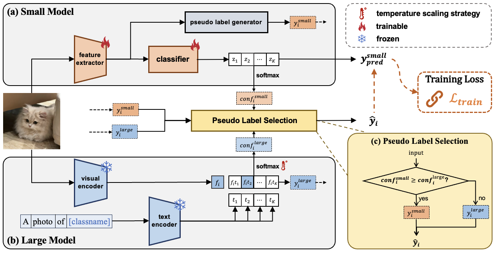

# CGPL: Confidence Guided Pseudo Labeling

## Introduction

The paper: ***Let Confidence Speak: Combining Small and Large Models via Pseudo Labeling for Unsupervised Domain Adaptation***



## CGPL models

These models are all built upon the DeiT-Base architecture, where the small model is trained using [CDTrans](https://github.com/CDTrans/CDTrans) and the large model is based on [CLIP-Large](https://huggingface.co/laion/CLIP-ViT-L-14-laion2B-s32B-b82K).

#### Office-31

| Task | A→D | A→W | D→A | D→W | W→A | W→D |
| :------------: | :------------: | :------------: | :------------: | :------------: | :------------: | :------------: |
|**Download Link** | [model](https://drive.google.com/file/d/1YSOT5OqR9VO_t2nEu5VKwwNnUPJTRScc/view?usp=drive_link) | [model](https://drive.google.com/file/d/1hhMnWhkbhiD_HY1wrKwZRgT7XMj6zVHu/view?usp=drive_link) | [model](https://drive.google.com/file/d/17ZAXm9Z8UF7w-KeN2XQnGRfKmFY_gFY0/view?usp=drive_link) | [model](https://drive.google.com/file/d/1N3gkoe51URC1-iXXBV7Ecbi2GDs0vwCV/view?usp=drive_link) | [model](https://drive.google.com/file/d/1QkYqw3CaVnfGVcGzPpjDNnTjlVxZIaIA/view?usp=drive_link) | [model](https://drive.google.com/file/d/1jg0VzZnTmcDba2izkj1w_ggSqlyIqOG0/view?usp=drive_link) |

#### Office-Home

| Task | Ar→Cl | Ar→Pr | Ar→Rw | Cl→Ar | Cl→Pr | Cl→Rw | Pr→Ar | Pr→Cl | Pr→Rw | Rw→Ar | Rw→Cl | Rw→Pr |
| :------------: |  :------------: | :------------: | :------------: | :------------: | :------------: | :------------: | :------------: | :------------: | :------------: | :------------: | :------------: | :------------: |
|**Download Link** | [model](https://drive.google.com/file/d/1hSmk4vg-v9UIA1ZkIrGkp80lswVheDx2/view?usp=drive_link) | [model](https://drive.google.com/file/d/1X21jsAtY1lAlFJsDFvrLcxHqY7eVaWAt/view?usp=drive_link) | [model](https://drive.google.com/file/d/1d5pBO2b7ZyKuNUUqeFsRZN7WkWvBpJCo/view?usp=drive_link) | [model](https://drive.google.com/file/d/1YzhiB100WpYnq-nYg2SSpU5ETpA0g1Z2/view?usp=drive_link) | [model](https://drive.google.com/file/d/1BAJPF7aQlyLkdNNI2HnYyIhOY397_ujr/view?usp=drive_link) | [model](https://drive.google.com/file/d/1Yd9bh8WwYMfL2ARs3lKtz0CPFX-ByOUd/view?usp=drive_link) | [model](https://drive.google.com/file/d/10gi40AvJl-hDT_oDTON-g0oMvbWDe9Qe/view?usp=drive_link) | [model](https://drive.google.com/file/d/1FQnr7eAUxpER0vEC5rjy5ubd1s6k7uo7/view?usp=drive_link) | [model](https://drive.google.com/file/d/1f2Ks5Xe6_R1wYSimCmZMcy45fcXpXDcy/view?usp=drive_link) | [model](https://drive.google.com/file/d/116upnzCPzMoSHvHarfzvKQaUJMWbO3Vm/view?usp=drive_link) | [model](https://drive.google.com/file/d/1dniiAVqDylFOIkw-7B-POVOD0d2RhHLe/view?usp=drive_link) | [model](https://drive.google.com/file/d/1RZ4XPrxBZ3BNLlew-yv9M1nDoYV7BDRm/view?usp=drive_link) |

#### VisDA-2017

| Dataset | VisDA-2017 |
|  :------------: | :------------: |
|**Download Link** | [model](https://drive.google.com/file/d/1kVN-OkIBlgA6DjZb_moOkvLJ2OzrMkIZ/view?usp=drive_link) |

#### DomainNet

| domain | clp | inf | pnt | qdr | rel | skt |
|  :------------: | :------------: | :------------: | :------------: | :------------: | :------------: | :------------: |
|**clp**| - | [model](https://drive.google.com/file/d/1puiWXpbLGKFpJ6HlZ4EZ_9yfsAASaM1i/view?usp=drive_link) | [model](https://drive.google.com/file/d/1h5s9ORXRR-KrR9Df_lxAmJ45bSrkGNO8/view?usp=drive_link) | [model](https://drive.google.com/file/d/1GDXR-gz5jnsul9DcjitItOkRqqghMYrs/view?usp=drive_link) | [model](https://drive.google.com/file/d/1VIXj-OzuM1kQcYLY21CUqrnr163ZwOSU/view?usp=drive_link) | [model](https://drive.google.com/file/d/161P188tkcN1BTyLUoOjJImxYtCyV6JTI/view?usp=drive_link) |
|**inf**| [model](https://drive.google.com/file/d/1wrVwH5mqlOfYGqBzNxEt00x2BF6GqJB4/view?usp=drive_link) | - | [model](https://drive.google.com/file/d/1HLA75EaIqfaV4NnHoVwToLLs0t_k0zas/view?usp=drive_link) | [model](https://drive.google.com/file/d/1UEESa057gS3SFWbC6FRoUpvgFBZK6TvX/view?usp=drive_link) | [model](https://drive.google.com/file/d/10rLhWqi5DzszmIbIFmsxDoL0cPQWCLEz/view?usp=drive_link) | [model](https://drive.google.com/file/d/1E28S9OQVpRmOKdgrX1Q06yDdPcotc8h9/view?usp=drive_link) |
|**pnt**| [model](https://drive.google.com/file/d/11sptJlAl04uXsgfk8DCJ2pVEU72uaXcO/view?usp=drive_link) | [model](https://drive.google.com/file/d/1T0nTiRWdLF0_fMUldbmJWMZiKSeOcBu6/view?usp=drive_link) | - | [model](https://drive.google.com/file/d/1fjuZvXGm7NmERWlGW62dQOuo7pwAzFJu/view?usp=drive_link) | [model](https://drive.google.com/file/d/15NcX39mc1iMXtbwdAIQGn7iGGQBVGWnT/view?usp=drive_link) | [model](https://drive.google.com/file/d/1Sj96K0bkhvX90Co6ec-JWthNdScfDwLa/view?usp=drive_link) |
|**qdr**| [model](https://drive.google.com/file/d/1GZkycpM4JubKu2lVTEZoe29jSbTM5oy0/view?usp=drive_link) | [model](https://drive.google.com/file/d/1vOBkAKQbdNQkGJ9Z475_FVtQTkKTUveu/view?usp=drive_link) | [model](https://drive.google.com/file/d/15CWZH5RO2I4tl5OxKU_7XkKxBzuciprW/view?usp=drive_link) | - | [model](https://drive.google.com/file/d/1Iu7QmBRw53UbOVAeqvaoUdQgxcj0vys-/view?usp=drive_link) | [model](https://drive.google.com/file/d/1_FhX8GH032BSd3lBK8W_2Jbpz4Ko_rsB/view?usp=drive_link) |
|**rel**| [model](https://drive.google.com/file/d/1AWdtOQVg1-SAGsoSHi5fsbfOlZDKwT04/view?usp=drive_link) | [model](https://drive.google.com/file/d/1ZyN7hHsegpIw-wfNdfQ-J1NnCtDvINQa/view?usp=drive_link) | [model](https://drive.google.com/file/d/1MHrfTlT6EBPY37qeBqo8rwhkF9JW4fmR/view?usp=drive_link) | [model](https://drive.google.com/file/d/1_m-4m_-XCwxP7TR0NoQ1eUHvz0OcN8JK/view?usp=drive_link) | - | [model](https://drive.google.com/file/d/1iVCXht3FfdrQhNECbw36LZirXwHc8Ync/view?usp=drive_link) |
|**skt**| [model](https://drive.google.com/file/d/1d8QlTRGvctusChmYbvcmVOnu-yEu_j0c/view?usp=drive_link) | [model](https://drive.google.com/file/d/1XtBOnNlrFYJALEB8sASK2-xpr1zuk6cn/view?usp=drive_link) | [model](https://drive.google.com/file/d/18REAY4uspGDO67jW9v7VlGj_uGIpCRp6/view?usp=drive_link) | [model](https://drive.google.com/file/d/1sighkR_8-rM26fks2mcDdob_5wXta-Yr/view?usp=drive_link) | [model](https://drive.google.com/file/d/1YYPR4niH6SlbtEgJjFJtLrMLetCcaoe7/view?usp=drive_link) | - |

## Getting started

### Install dependencies

```bash
conda env create -f environment.yml -n CGPL
conda activate CGPL
(Python version is the 3.7 and the GPU is the V100 with cuda 10.1, cudatoolkit 10.1)
```

### Prepare datasets

Download the UDA datasets:

| dataset name | download link |
| ------------ | ------------- |
| Office-31    | [Office-31](https://drive.google.com/file/d/0B4IapRTv9pJ1WGZVd1VDMmhwdlE/view) |
| Office-Home  | [Office-Home](https://www.hemanthdv.org/officeHomeDataset.html) |
| VisDA-2017   | [VisDA-2017](http://csr.bu.edu/ftp/visda17/clf/) |
|DomainNet    | [DomainNet](http://ai.bu.edu/M3SDA/) |

The file directory structure should be:

```
CGPL-master
|-- data
    |-- Office-31
    |   |-- class_name
    |       |-- images
    |-- OfficeHomeDataset
    |   |-- class_name
    |       |-- images
    |-- visda
    |   |-- train
    |   |   |-- class_name
    |   |       |-- images
    |   |-- validation
    |       |-- class_name
    |           |-- images
    |-- domainnet
        |-- class_name
            |-- images
```

### Prepare models

We use the DeiT parameter init our model based on ViT.
Download the ImageNet pretrained transformer model:

| model name   | download link |
| ------------ | ------------- |
| DeiT-Small   | [DeiT-Small](https://dl.fbaipublicfiles.com/deit/deit_small_distilled_patch16_224-649709d9.pth) |
| DeiT-Base    | [DeiT-Base](https://dl.fbaipublicfiles.com/deit/deit_base_distilled_patch16_224-df68dfff.pth) |

### Pretrain classifier

We utilize 1 GPU for pre-training.

```
# Command input paradigm
bash scripts/pretrain/[office31/officehome/visda/domainnet]/*.sh [deit_base/deit_small]
```

### Train classifier

We utilize 2 GPU for UDA.

```
# Command input paradigm
bash scripts/uda/[office31/officehome/visda/domainnet]/*.sh [deit_base/deit_small]
```

### Evaluation

```bash
# For example VisDA-2017
python test.py --config_file 'configs/uda.yml' MODEL.DEVICE_ID "('0')" TEST.WEIGHT "('../logs/uda/vit_base/visda/transformer_best_model.pth')" DATASETS.NAMES 'VisDA' DATASETS.NAMES2 'VisDA' OUTPUT_DIR '../logs/uda/vit_base/visda/' DATASETS.ROOT_TRAIN_DIR './data/visda/train/train_image_list.txt' DATASETS.ROOT_TRAIN_DIR2 './data/visda/train/train_image_list.txt' DATASETS.ROOT_TEST_DIR './data/visda/validation/valid_image_list.txt'
```

## Acknowledgement

Codebase from [CDTrans](https://github.com/CDTrans/CDTrans)
